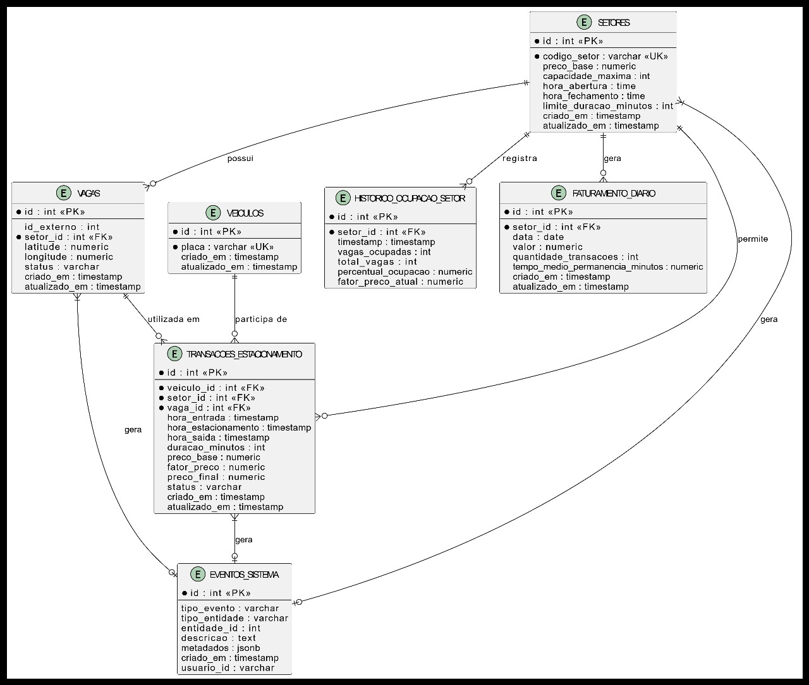

# Sistema de Gestão de Estacionamentos

Este projeto implementa um sistema de gestão de estacionamentos robusto e escalável, focado em backend, para controlar a entrada, saída, ocupação de vagas e faturamento de forma automatizada. O sistema interage com um simulador externo para eventos e aplica regras de preço dinâmico baseadas na ocupação dos setores.

## 1. Contexto do Projeto

O sistema foi desenvolvido para a Estapar, com o objetivo de automatizar o controle de estacionamentos. Ele opera puramente como um backend, expondo APIs REST para consultas e recebendo webhooks de um simulador para processamento de eventos em tempo real. A arquitetura é baseada em microserviços, utilizando Kotlin e Micronaut, e segue princípios de código limpo e design orientado a domínio.

## 2. Diagrama do Banco de Dados


A imagem abaixo representa o modelo de banco de dados utilizado no sistema:



### Explicação do Modelo de Dados

O modelo de dados foi projetado para suportar todas as funcionalidades do sistema de gestão de estacionamentos. As principais tabelas são:

*   **setores**: Armazena informações sobre os diferentes setores da garagem, como código do setor, preço base, capacidade máxima, horários de funcionamento e limites de duração.
*   **vagas**: Contém detalhes sobre cada vaga de estacionamento individual, incluindo seu ID externo (fornecido pelo simulador), o setor ao qual pertence, coordenadas geográficas (latitude e longitude) e o status atual da vaga (disponível, ocupada, etc.).
*   **veiculos**: Registra os veículos que utilizam o estacionamento, identificados unicamente pela placa.
*   **transacoes_estacionamento**: É a tabela central que registra todo o ciclo de vida de um veículo no estacionamento. Inclui informações como o veículo, setor, vaga (quando estacionado), horários de entrada, estacionamento e saída, duração da permanência, preço base, fator de preço dinâmico aplicado e o preço final cobrado. O status da transação (ENTROU, ESTACIONADO, SAIU, CANCELADO) rastreia o progresso do veículo.
*   **historico_ocupacao_setor**: Mantém um registro histórico da ocupação de cada setor ao longo do tempo. Isso é crucial para a lógica de preço dinâmico, pois armazena o número de vagas ocupadas, o total de vagas, o percentual de ocupação e o fator de preço correspondente em momentos específicos.
*   **faturamento_diario**: Consolida o faturamento diário por setor, registrando o valor total arrecadado, a quantidade de transações e o tempo médio de permanência dos veículos. Isso facilita a consulta de relatórios financeiros.
*   **eventos_sistema**: Funciona como uma trilha de auditoria, registrando eventos importantes do sistema, como entradas e saídas de veículos, alterações de preço, etc. Isso é útil para diagnóstico e monitoramento.

O modelo utiliza chaves primárias (PK) e estrangeiras (FK) para garantir a integridade referencial dos dados. Índices foram criados em colunas frequentemente consultadas para otimizar o desempenho das queries.

## 3. Funcionamento do Webhook

O sistema recebe notificações de eventos do simulador de estacionamento através de um endpoint de webhook. Esses eventos são cruciais para o funcionamento em tempo real do sistema.

**Endpoint do Webhook:** `POST /webhook` (escutando em `http://localhost:3003/webhook`)

O webhook aceita requisições POST com um corpo JSON que descreve o evento ocorrido. Os tipos de eventos suportados são:

### 3.1. Entrada na Garagem (ENTRY)

Quando um veículo entra na garagem, o simulador envia um evento `ENTRY`.

**Payload JSON:**

```json
{
  "license_plate": "ZUL0001",
  "entry_time": "2025-01-01T12:00:00.000Z",
  "event_type": "ENTRY"
}
```

**Ações do Sistema:**

1.  **Verifica Lotação do Setor:** Consulta a tabela `historico_ocupacao_setor` para verificar a ocupação atual do setor inferido pela configuração inicial (ou um setor padrão, se aplicável).
2.  **Rejeita se Lotado:** Se o setor estiver com 100% de ocupação, a entrada é rejeitada e um evento é registrado na tabela `eventos_sistema`.
3.  **Calcula Fator de Preço:** Se houver vagas, consulta `historico_ocupacao_setor` para obter a ocupação atual e calcula o `fator_preco` com base nas seguintes regras:
    *   Ocupação < 25%: desconto de 10% (fator = 0.9)
    *   Ocupação ≥ 25% e < 50%: preço normal (fator = 1.0)
    *   Ocupação ≥ 50% e < 75%: aumento de 10% (fator = 1.1)
    *   Ocupação ≥ 75% e < 100%: aumento de 25% (fator = 1.25)
4.  **Registra Veículo:** Insere um novo registro na tabela `veiculos` se a placa for nova, ou recupera o ID do veículo existente.
5.  **Cria Transação:** Insere um novo registro na tabela `transacoes_estacionamento` com:
    *   `veiculo_id`
    *   `setor_id` (do setor de entrada)
    *   `hora_entrada`
    *   `preco_base` (do setor)
    *   `fator_preco` (calculado)
    *   `status` = "ENTROU"
6.  **Atualiza Ocupação:** Atualiza o registro correspondente em `historico_ocupacao_setor`, incrementando `vagas_ocupadas` e recalculando `percentual_ocupacao` e `fator_preco_atual`.

### 3.2. Veículo Estacionado (PARKED)

Quando um veículo estaciona em uma vaga específica, o simulador envia um evento `PARKED`.

**Payload JSON:**

```json
{
  "license_plate": "ZUL0001",
  "lat": -23.561684,
  "lng": -46.655981,
  "event_type": "PARKED"
}
```

**Ações do Sistema:**

1.  **Identifica Vaga:** Consulta a tabela `vagas` utilizando as coordenadas (`lat`, `lng`) para obter o `id` da vaga e o `setor_id`.
2.  **Localiza Transação:** Recupera a transação aberta (status "ENTROU") para a `license_plate` na tabela `transacoes_estacionamento`.
3.  **Atualiza Transação:** Atualiza o registro da transação em `transacoes_estacionamento` com:
    *   `vaga_id`
    *   `hora_estacionamento` (timestamp atual)
    *   `status` = "ESTACIONADO"
4.  **Atualiza Status da Vaga:** Atualiza o `status` da vaga na tabela `vagas` para "OCUPADA".

### 3.3. Saída da Garagem (EXIT)

Quando um veículo sai da garagem, o simulador envia um evento `EXIT`.

**Payload JSON:**

```json
{
  "license_plate": "ZUL0001", // Note: O exemplo original mostra a placa vazia, mas o sistema deve buscar pela placa do veículo que está saindo.
  "exit_time": "2025-01-01T12:00:00.000Z",
  "event_type": "EXIT"
}
```

**Ações do Sistema:**

1.  **Localiza Transação:** Recupera a transação aberta (status "ESTACIONADO" ou "ENTROU") para a `license_plate` na tabela `transacoes_estacionamento`.
2.  **Calcula Duração:** Calcula a `duracao_minutos` subtraindo `hora_entrada` de `exit_time`.
3.  **Calcula Preço Final:** Calcula o `preco_final` usando a fórmula: `preco_base * fator_preco * (duracao_minutos / 60)`.
4.  **Atualiza Transação:** Atualiza o registro da transação em `transacoes_estacionamento` com:
    *   `hora_saida` (`exit_time`)
    *   `duracao_minutos`
    *   `preco_final`
    *   `status` = "SAIU"
5.  **Libera Vaga:** Atualiza o `status` da vaga (identificada pelo `vaga_id` na transação) na tabela `vagas` para "DISPONIVEL".
6.  **Atualiza Ocupação:** Atualiza o registro correspondente em `historico_ocupacao_setor`, decrementando `vagas_ocupadas` e recalculando `percentual_ocupacao` e `fator_preco_atual`.
7.  **Registra Faturamento:** Insere ou atualiza um registro na tabela `faturamento_diario` para o `setor_id` e a `data` da saída, somando o `preco_final` ao `valor` e incrementando `quantidade_transacoes`.

## 4. APIs do Projeto

O sistema expõe as seguintes APIs REST para consulta de informações:

### 4.1. Consulta de Status de Placa

Permite consultar informações sobre um veículo específico a partir da sua placa.

*   **Endpoint:** `POST /plate-status`
*   **Request Body:**

    ```json
    {
      "license_plate": "ZUL0001"
    }
    ```
*   **Response Body (200 OK):**

    ```json
    {
      "license_plate": "ZUL0001",
      "price_until_now": 15.00, // Exemplo de valor calculado
      "entry_time": "2025-01-01T12:00:00.000Z",
      "time_parked": "2025-01-01T12:05:00.000Z", // Hora que estacionou na vaga
      "lat": -23.561684,
      "lng": -46.655981
    }
    ```
*   **Response Body (404 Not Found):** Se o veículo não estiver no estacionamento (sem transação ativa).

**Interação com o Banco de Dados:**

1.  Consulta a tabela `veiculos` para obter o `id` do veículo pela `license_plate`.
2.  Consulta a tabela `transacoes_estacionamento` filtrando por `veiculo_id` e `status` diferente de "SAIU" e "CANCELADO".
3.  Se encontrada uma transação, recupera `hora_entrada`, `hora_estacionamento`, `preco_base`, `fator_preco` e `vaga_id`.
4.  Se `vaga_id` estiver preenchido, consulta a tabela `vagas` para obter `lat` e `lng`.
5.  Calcula o `price_until_now`: `preco_base * fator_preco * (minutos_desde_entrada / 60)`.

### 4.2. Consulta de Status de Vaga

Permite consultar o status de uma vaga específica através de suas coordenadas geográficas.

*   **Endpoint:** `POST /spot-status`
*   **Request Body:**

    ```json
    {
      "lat": -23.561684,
      "lng": -46.655981
    }
    ```
*   **Response Body (200 OK - Vaga Ocupada):**

    ```json
    {
      "ocupied": true,
      "license_plate": "ZUL0001",
      "price_until_now": 15.00,
      "entry_time": "2025-01-01T12:00:00.000Z",
      "time_parked": "2025-01-01T12:05:00.000Z"
    }
    ```
*   **Response Body (200 OK - Vaga Disponível):**

    ```json
    {
      "ocupied": false,
      "license_plate": "",
      "price_until_now": 0.00,
      "entry_time": null,
      "time_parked": null
    }
    ```
*   **Response Body (404 Not Found):** Se a vaga com as coordenadas especificadas não existir.

**Interação com o Banco de Dados:**

1.  Consulta a tabela `vagas` filtrando por `latitude` e `longitude` para obter o `id` da vaga e seu `status`.
2.  Se `status` for "OCUPADA":
    *   Consulta a tabela `transacoes_estacionamento` filtrando por `vaga_id` e `status` = "ESTACIONADO".
    *   Recupera `veiculo_id`, `hora_entrada`, `hora_estacionamento`, `preco_base`, `fator_preco`.
    *   Consulta a tabela `veiculos` para obter a `license_plate`.
    *   Calcula o `price_until_now`.
3.  Se `status` for "DISPONIVEL" ou outro, retorna `ocupied: false`.

### 4.3. Consulta de Faturamento

Permite consultar o faturamento de um setor específico em uma data determinada.

*   **Endpoint:** `GET /revenue`
*   **Request Query Parameters:**
    *   `date`: Data do faturamento (formato YYYY-MM-DD)
    *   `sector`: Código do setor (ex: "A")
*   **Response Body (200 OK):**

    ```json
    {
      "amount": 1250.75,
      "currency": "BRL",
      "timestamp": "2025-01-01T23:59:59.999Z" // Timestamp do final do dia consultado
    }
    ```
*   **Response Body (404 Not Found):** Se o setor não existir ou não houver faturamento para a data.

**Interação com o Banco de Dados:**

1.  Consulta a tabela `setores` para obter o `id` do setor pelo `codigo_setor`.
2.  Consulta a tabela `faturamento_diario` filtrando por `setor_id` e `data`.
3.  Se um registro for encontrado, retorna o `valor` (amount).
4.  Se não houver registro em `faturamento_diario` (pode acontecer se o job de consolidação ainda não rodou ou se não houve movimentação), o sistema pode optar por calcular dinamicamente:
    *   Consultar `transacoes_estacionamento` filtrando por `setor_id`, `status` = "SAIU", e onde `hora_saida` esteja dentro da `date` especificada.
    *   Somar todos os `preco_final` dessas transações.

## 5. Interação Backend com Banco de Dados

A interação entre o backend e o banco de dados é fundamental para a persistência e consulta das informações. Abaixo, detalhamos os momentos chave dessa interação:

### 5.1. Inicialização do Sistema

*   **Ação:** Na primeira inicialização do sistema (ou quando solicitado).
*   **Fluxo:**
    1.  O `GarageInitializationService` faz uma chamada `GET /garage` à API do simulador.
    2.  **Persistência:** Os dados recebidos (setores e vagas) são mapeados para as entidades `Setor` e `Vaga`.
    3.  Novos registros são inseridos nas tabelas `setores` e `vagas`.
    4.  Para cada setor, um registro inicial é criado na tabela `historico_ocupacao_setor` com `vagas_ocupadas` = 0, `total_vagas` = `capacidade_maxima` do setor, e o `fator_preco_atual` correspondente a 0% de ocupação.

### 5.2. Processamento de Webhooks

Conforme detalhado na seção 


3. Funcionamento do Webhook, as interações com o banco de dados ocorrem da seguinte forma:

*   **ENTRY (Entrada):**
    *   **Consulta:** `historico_ocupacao_setor` (para verificar lotação e calcular fator de preço).
    *   **Inserção/Consulta:** `veiculos` (para registrar ou obter ID do veículo).
    *   **Inserção:** `transacoes_estacionamento` (para registrar a entrada).
    *   **Atualização:** `historico_ocupacao_setor` (para atualizar contadores de ocupação).
    *   **Inserção:** `eventos_sistema` (em caso de rejeição por lotação).

*   **PARKED (Estacionamento):**
    *   **Consulta:** `vagas` (para identificar a vaga pelas coordenadas).
    *   **Consulta:** `transacoes_estacionamento` (para localizar a transação aberta do veículo).
    *   **Atualização:** `transacoes_estacionamento` (para registrar a vaga e hora de estacionamento).
    *   **Atualização:** `vagas` (para mudar o status da vaga para "OCUPADA").

*   **EXIT (Saída):**
    *   **Consulta:** `transacoes_estacionamento` (para localizar a transação aberta).
    *   **Atualização:** `transacoes_estacionamento` (para registrar hora de saída, duração, preço final e status).
    *   **Atualização:** `vagas` (para mudar o status da vaga para "DISPONIVEL").
    *   **Atualização:** `historico_ocupacao_setor` (para atualizar contadores de ocupação).
    *   **Inserção/Atualização:** `faturamento_diario` (para registrar o faturamento do dia).

### 5.3. Processamento de Chamadas de API

*   **Consulta de Status de Placa (`/plate-status`):**
    *   **Consulta:** `veiculos` (para obter o ID do veículo).
    *   **Consulta:** `transacoes_estacionamento` (para encontrar a transação ativa do veículo).
    *   **Consulta:** `vagas` (se a transação tiver `vaga_id`, para obter coordenadas).

*   **Consulta de Status de Vaga (`/spot-status`):**
    *   **Consulta:** `vagas` (para encontrar a vaga pelas coordenadas e seu status).
    *   **Consulta:** `transacoes_estacionamento` (se a vaga estiver ocupada, para obter detalhes da transação).
    *   **Consulta:** `veiculos` (para obter a placa do veículo ocupando a vaga).

*   **Consulta de Faturamento (`/revenue`):**
    *   **Consulta:** `setores` (para obter o ID do setor).
    *   **Consulta:** `faturamento_diario` (para obter o faturamento consolidado).
    *   **Consulta (Opcional/Fallback):** `transacoes_estacionamento` (se `faturamento_diario` não tiver o registro, para calcular o faturamento dinamicamente).

## 6. Tecnologias Utilizadas

*   **Linguagem de Programação:** Kotlin
*   **Framework:** Micronaut (para desenvolvimento de microserviços e APIs)
*   **Banco de Dados:** PostgreSQL (modelo relacional, conforme diagrama)
*   **Gerenciamento de Dependências:** Gradle
*   **Contêinerização:** Docker (para o simulador e ambiente de desenvolvimento)

## 7. Como Rodar o Projeto

Para rodar o projeto localmente, siga os passos abaixo:

1.  **Pré-requisitos:**
    *   Java Development Kit (JDK) 17 ou superior
    *   Docker e Docker Compose
    *   Gradle (gerenciador de build)

2.  **Configuração do Banco de Dados:**
    *   Certifique-se de ter uma instância do PostgreSQL rodando e acessível.
    *   Crie um banco de dados para o projeto (ex: `estacionamento_db`).
    *   As tabelas serão criadas automaticamente pelo Micronaut/Hibernate ao iniciar a aplicação, com base nas entidades do projeto e no script SQL fornecido.

3.  **Configuração do Simulador:**
    *   O simulador é um serviço Docker que envia eventos e fornece a configuração da garagem.
    *   Certifique-se de que o simulador esteja rodando e acessível na URL `http://localhost:3003`.
    *   (Assumindo que o simulador pode ser iniciado via Docker Compose ou similar, instruir o usuário a fazê-lo aqui).

4.  **Configuração da Aplicação:**
    *   Clone o repositório do projeto.
    *   Navegue até o diretório raiz do projeto.
    *   Atualize as configurações de conexão com o banco de dados no arquivo `application.yml` (ou `application-dev.yml`) para apontar para sua instância do PostgreSQL.
    *   Certifique-se de que a URL do webhook do simulador esteja configurada corretamente para `http://localhost:3003/webhook`.

5.  **Execução:**
    *   Para construir e rodar a aplicação, utilize o Gradle:
        ```bash
        ./gradlew run
        ```
    *   A aplicação estará disponível em `http://localhost:8080` (porta padrão do Micronaut, se não alterada).

## 8. Regras Atendidas e Validadas

O sistema foi projetado e implementado para atender e validar as seguintes regras técnicas, funcionais e de negócio:

### 8.1. Requisitos Funcionais

*   **Inicialização e Configuração do Sistema:** O sistema obtém a configuração da garagem do simulador (`GET /garage`) e persiste os dados de setores e vagas no banco de dados, preparando-se para receber eventos.
*   **Processamento de Entrada de Veículo (ENTRY):** Processa eventos de entrada, verifica lotação do setor, calcula o fator de preço dinâmico com base na ocupação, registra o veículo e a transação de entrada, e atualiza os contadores de ocupação.
*   **Processamento de Estacionamento (PARKED):** Processa eventos de estacionamento, localiza a transação aberta, registra as coordenadas da vaga, atualiza o status da transação e da vaga.
*   **Processamento de Saída de Veículo (EXIT):** Processa eventos de saída, calcula o tempo de permanência e o valor final a ser pago (aplicando o fator de preço da entrada), registra a saída, libera a vaga, atualiza contadores de ocupação e registra o faturamento diário.
*   **Consulta de Status de Placa (`/plate-status`):** Permite consultar informações detalhadas sobre um veículo específico (tempo de entrada, coordenadas, valor atual) se ele estiver no estacionamento.
*   **Consulta de Status de Vaga (`/spot-status`):** Permite consultar o status de uma vaga específica (ocupada/disponível) e, se ocupada, fornece detalhes do veículo e o valor atual.
*   **Consulta de Faturamento (`/revenue`):** Permite consultar o faturamento de um setor em uma data específica, considerando todas as transações finalizadas.

### 8.2. Regras de Negócio

*   **Preço Dinâmico:** Implementado conforme as faixas de ocupação (0-25%, 25-50%, 50-75%, 75-100%) com seus respectivos fatores de preço (0.9, 1.0, 1.1, 1.25). O fator é fixado no momento da entrada para garantir transparência.
*   **Controle de Lotação:** O sistema impede novas entradas em setores que atingiram 100% de ocupação, registrando o evento no log do sistema.

### 8.3. Considerações Técnicas

*   **Concorrência:** A arquitetura do Micronaut e o uso de transações de banco de dados garantem que o sistema lide corretamente com múltiplos eventos simultâneos.
*   **Idempotência:** As operações de webhook são projetadas para serem idempotentes, minimizando problemas com retentativas.
*   **Validações:** Todas as entradas de dados são validadas para garantir a consistência.
*   **Tratamento de Erros:** Cenários excepcionais (veículo sem registro, saída sem entrada, coordenadas inválidas) são tratados adequadamente.
*   **Logging:** Implementação de logging abrangente para diagnóstico.
*   **Transações de Banco de Dados:** Uso de transações para garantir a atomicidade e consistência dos dados.
*   **Testes:** (Assumindo que testes unitários e de integração foram implementados para validar o comportamento do sistema).
   
### 8.4. Melhorias e pontos de atenção

*   A desconto poderia ser algo parametrizavel no BD para não depender dessa implementação no back-end necessariamente, o valor poderia ser definido quando o carro entrar na garagem ou seja quando o valor for cadastrado no banco de dados 
*   foi considerado para o calculo do valor a ser pago o tempo que foi permanecido na vaga, ou seja o preço não foi necessariamente um valor fixo

## 9. Coleção Postman

Para facilitar o teste e a interação com as APIs do projeto, disponibilizamos a coleção Postman. Você pode importá-la diretamente no seu aplicativo Postman.

**Link para a Coleção Postman:**

[projeto.postman_collection.json](projeto.postman_collection.json)


